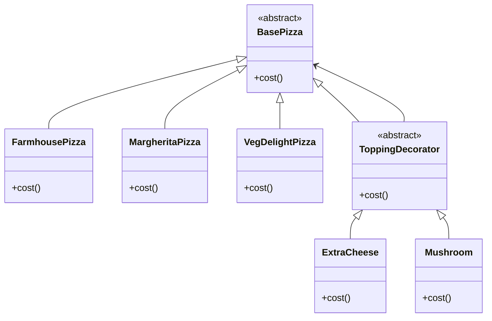

### WIP

# Design Patterns


### Decorator Design Pattern

In Decorator Pattern is also widely used pattern in real life situation. 
This is very helpful when we want to extend the functionality of certain class independently of other instances of same class.
It is done by wrapping original class by another decorator class.




**BasePizza abstract class**
```java
public abstract class BasePizza {
    public abstract int cost();
}
```
**FarmhousePizza class**
```java
public class FarmhousePizza extends BasePizza {
    @Override
    public int cost() {
        return 200;
    }
}
```
**MargheritaPizza class**
```java
public class MargheritaPizza extends BasePizza {
    @Override
    public int cost() {
        return 100;
    }
}
```
**VegDelightPizza class**
```java
public class VegDelightPizza extends BasePizza {
    @Override
    public int cost() {
        return 120;
    }
}
```
**ToppingDecorator abstract class**
```java
public abstract class ToppingDecorator extends BasePizza {}
```

**ExtraCheese abstract class**
```java
public class ExtraCheese extends ToppingDecorator {
    BasePizza basePizza;
    
    public ExtraCheese(BasePizza pizza) {
        this.basePizza = pizza;
    }
    
    @Override
    public int cost() {
        return this.basePizza.cost() + 10;
    }
}
```

**Mushroom abstract class**
```java
public class Mushroom extends ToppingDecorator {
    BasePizza basePizza;
    
    public Mushroom(BasePizza pizza) {
        this.basePizza = pizza;
    }
    
    @Override
    public int cost() {
        return this.basePizza.cost() + 15;
    }
}
```

Here if we do something like ``let pizza = new Mushroom(new ExtraCheese(new FamhousePizza()));`` and call ``pizza.cost()``this will return 225.