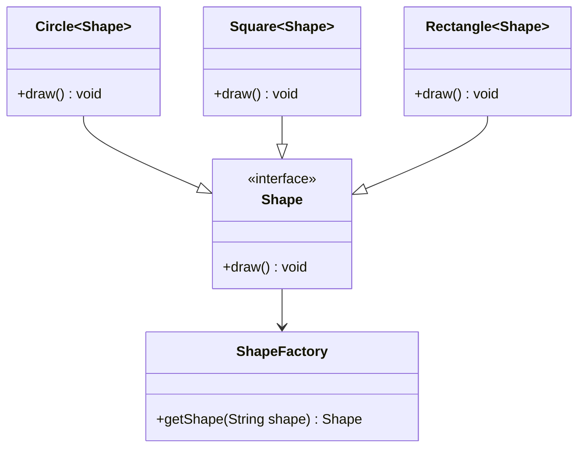

### WIP

# Design Patterns


### Factory Design Pattern


**Code**
```java
public class ShapeFactory {
    Shape getShape(String shape) {
        switch(shape) {
            case "CIRCLE":
                return new Circle();
            case "SQUARE":
                return new Square();
            case "RECTANGLE":
                return new Rectangle();
            default:
                return null;
        }
    }
}

public interface Shape {
    public void draw();
}

public class Circle implements Shape {
    @Override
    void draw() {
        logger.info("circle drawn");
    }
} 

public class Rectangle implements Shape {
    @Override
    void draw() {
        logger.info("rectangle drawn");
    }
} 

public class Square implements Shape {
    @Override
    void draw() {
        logger.info("square drawn");
    }
} 
```
In above example we can see that ShapeFactory can get us specific shape object based on input.
This is known as factory pattern. Factory Pattern is very useful as any new object creation will have to call single method 
from Factory class and pass in conditions to get required object. 
This pattern can be extended with Abstract Factory Pattern.


### Abstract Factory Pattern

