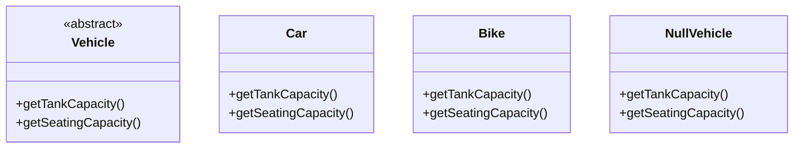

### WIP

# Design Patterns

### Null Object Design pattern

```mermaid
classDiagram
    class Vehicle {
        <<abstract>>
        +getTankCapacity()
        +getSeatingCapacity()
    }
    class Car {
        +getTankCapacity()
        +getSeatingCapacity()
    }
    class Bike {
        +getTankCapacity()
        +getSeatingCapacity()
    }
    class NullVehicle {
        +getTankCapacity()
        +getSeatingCapacity()
    }
```

here we will return NullVehicle instead of null.