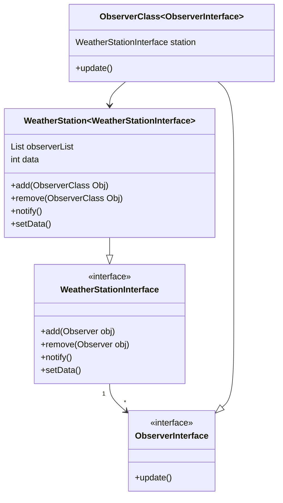

# Design Patterns


### Observer Design Pattern

In Observer design pattern we have one observable and many observers. 
Any state change in Observable state will update all observers about it.

Let us understand observer design pattern using an example below



**WeatherStationInterface**

```java
public interface WeatherStationInterface {
    public void add(ObserverClass Obj);
    public void remove(ObserverClass Obj);
    public void notify();
    public void setData(int data);
}
```
**WeatherStation**
```java
public class WeatherStation implements WeatherStationInterface {
    
    public List<ObserverInterface> observerList = new ArrayList();
    public int temp = null;
    
    @Override
    public void add(ObserverClass observer) {
        observerList.add(observer);
    }
    @Override
    public void remove(ObserverClass observer) {
        observerList.remove(observer);
    }
    @Override
    public void notify() {
        for(ObserverInterface observer: ObserverList) {
            observer.update();
        }
    }
    @Override
    public void setData(int data) {
        if(temp != data) {
            temp = data;
            notify();
        }
    }
}
```
**ObserverInterface**
```java
public interface ObserverInterface {
    public void update();
}
```

**ObserverClass**
```java
public class ObserverClass implements ObserverInterface {
    
    String email;
    WeatherStationInterface observable;
    
    public ObserverClass(String email, WeatherStationInterface observable) {
        this.email = email;
        this.observable = observable;
    }
    
    @Override
    public void update() {
        sendAlert();
        logger.info("Alert Sent to Observer");
    }
    
    private void sendAlert() {
        logger.info("sending alert to email: {}", email);
        //send the actual email alert here
    }
}
```


In above example we have weather station who has temperature data and observers. 
Observers can subscribe to data and once there is change in temperature. All Observers will get notified about it.
This is very useful in places like notify me when in stock button on marketplaces like Flipkart, Amazon or 
if you want to have feature to notify user about change. There is one-to-many relationship between observable to observers. 