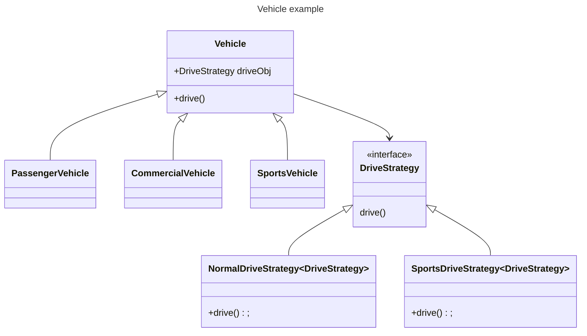

# Design Patterns


### Strategy Design Pattern

Let us understand strategy design pattern using an example below


**Vehicle Class:**
```java
public class Vehicle {
    DriveStrategy driveObject;
    
    Vehicle(DriveStrategy driveObj) {
        this.driveObject = driveObj;
    }
    
    public void drive() {
        driveObject.drive();
    }
}
```
**PassengerVehicle Class:**
```java
public class PassengerVehicle extends Vehicle {
    PassengerVehicle(DriveStrategy driveObj) {
        super(new NormalDriveStrategy());
    }
}
```
**SportsVehicle Class:**
```java
public class SportsVehicle extends Vehicle {
    SportsVehicle(DriveStrategy driveObj) {
        super(new SportsDriveStrategy());
    }
}
```
**CommercialVehicle Class:**
```java
public class CommercialVehicle extends Vehicle {
    CommercialVehicle(DriveStrategy driveObj) {
        super(new NormalDriveStrategy());
    }
}
```
**DriveStrategy Interface:**
```java
public interface DriveStrategy {
    public void drive();
}
```
**NormalDriveStrategy class:**
```java
public class NormalDriveStrategy implements DriveStrategy {
    @Override
    public void drive() {
        System.out.println("normal drive strategy");
    }
}
```
**SportsDriveStrategy class:**
```java
public class SportsDriveStrategy implements DriveStrategy {
    @Override
    public void drive() {
        System.out.println("sports drive strategy");
    }
}
```

In above example if we want to add different drive capability to different types of cars we will have lot of 
duplicate code for drive function as class will grow with new types of drive implementations so we can avoid this using 
``DriveStrategy`` interface. We are injecting constructor of vehicle with ``DriveStrategy`` Object this is also known as
ConstructorInjection.