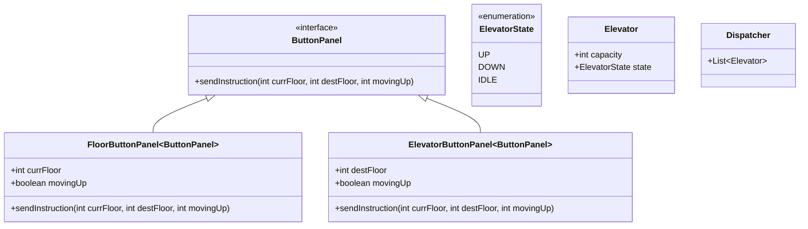

### WIP

# Elevator

### Requirements
* Elevator should move up and down
* buttons to control the car
  * Inside elevator
  * on floors to call elevator
* dispatcher unit algorithm

ProcessRequest in one direction and for up we will have min heap
to go down 

Best Article 
https://tedweishiwang.github.io/journal/object-oriented-design-elevator.html
