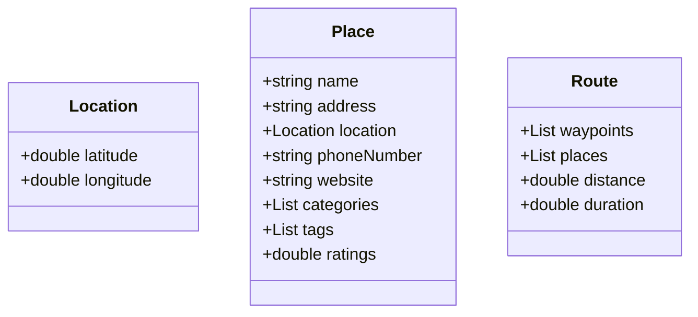

### WIP

# Google Maps

### Requirements
* Google Maps will have buildings and roads
* User should be able to view google map
* User must be able to get directions from point A to point B

On the surface it will look like much complex system but lets start breaking down Maps into small components.
Firstly we will need to have Location to identify place on map. Then we will have places at certain locations which 
will have name, address, location, ratings, category, tags.

