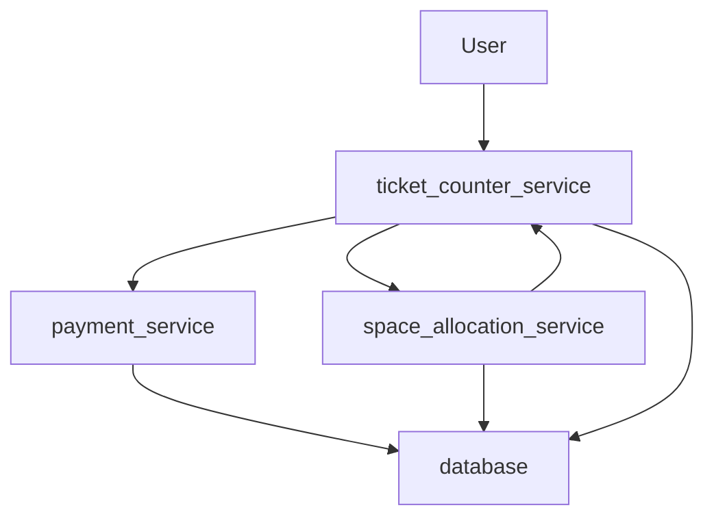
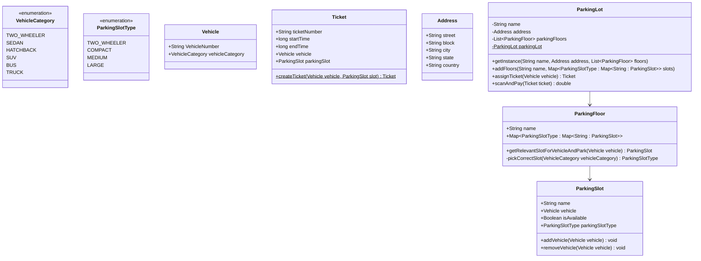

### WIP

# Parking Lot

### Requirements
* Multilevel parking lot
* Multiple category of parking space
* Multiple entry and exit (adds an interesting case of concurrency)
* Should not allow more vehicles than allocated space for each category
* Charge should be hourly basis
* Display available number of parking for each category at entry itself

### Approach 
We will start design using bottom up approach as we will use OOPs. Lets say I have `ParkingLot` and each 
`ParkingLot` will have multiple `ParkingFloor`. Each `ParkingFloor` will have multiple 
`ParkingSlot` with different type (typically based on size). `ParkingSlot` will be filled 
based on type of vehicle. Lets think about finding appropriate slot for a vehicle. We need to find slot in `ParkingFloor`
So we need to check floor wise where we have slot matching our `VehicleCategory`. To get Correct Category we will have 
one private method called `pickSlot(VehicleCategory category): ParkingSlotType` which will give use slot type we need to look for.
For each `ParkingFloor` we will iterate and check if `ParkingType` matches our requirement and if it's available. 
We will assign/add that slot to specific `Vehicle` and mark it as unavailable. 

### Overall Design


**Class Diagram**




***Ticket.java***
```java
@Builder
@Getter
@Setter
public class Ticket {
    String ticketNumber;
    long startTime;
    long endTime;
    Vehicle vehicle;
    ParkingSlot parkingSlot;

    public static Ticket createTicket(Vehicle vehicle,ParkingSlot parkingSlot){
        return Ticket.builder()
                .parkingSlot(parkingSlot)
                .startTime(System.currentTimeMillis())
                .vehicle(vehicle)
                .ticketNumber(vehicle.getVehicleNumber()+System.currentTimeMillis())
                .build();
    }
}
```
***Address.java***
```java
@Getter
@Setter
@Builder
public class Address {
    String street;
    String block;
    String city;
    String state;
    String country;
}
```

***ParkingSlotType.java***
```java
public enum ParkingSlotType {
    TwoWheeler{
        public double getPriceForParking(long duration){
            return duration*0.05;
        }
    },
    Compact{
        public double getPriceForParking(long duration){
            return duration*0.075;
        }
    },
    Medium{
        public double getPriceForParking(long duration){
            return duration*0.09;
        }
    },
    Large{
        public double getPriceForParking(long duration){
            return duration*0.10;
        }
    };

   public abstract double getPriceForParking(long duration);
}
```

***Vehicle.java***

```java
@Setter
@Getter
@EqualsAndHashCode
public class Vehicle {
    String vehicleNumber;
    VehicleCategory vehicleCategory;
}
```

***VehicleCategory.java***

```java
public enum VehicleCategory {
    TwoWheeler,
    Hatchback,
    Sedan,
    SUV,
    Bus
}
```
***ParkingSlot***
```java
@Getter
@Setter
public class ParkingSlot {
    String name;
    @Builder.Default
    boolean isAvailable = true;
    Vehicle vehicle;
    ParkingSlotType parkingSlotType;

    public ParkingSlot(String name, ParkingSlotType parkingSlotType) {
        this.name = name;
        this.parkingSlotType = parkingSlotType;
    }

    protected void addVehicle(Vehicle vehicle){
        this.vehicle = vehicle;
        this.isAvailable=false;
    }

    protected void removeVehicle(Vehicle vehicle){
        this.vehicle=null;
        this.isAvailable=true;
    }
}
```
***ParkingFloor.java***
```java
public class ParkingFloor {
    String name;
    Map<ParkingSlotType,Map<String,ParkingSlot>> parkingSlots;
    public ParkingFloor(String name , Map<ParkingSlotType,Map<String,ParkingSlot>> parkingSlots) {
        this.name=name;
        this.parkingSlots = parkingSlots;
    }

    public ParkingSlot getRelevantSlotForVehicleAndPark(Vehicle vehicle) {
        VehicleCategory vehicleCategory = vehicle.getVehicleCategory();
        ParkingSlotType parkingSlotType = pickCorrectSlot(vehicleCategory);
        Map<String,ParkingSlot> relevantParkingSlot = parkingSlots.get(parkingSlotType);
        ParkingSlot slot =null ;
        for(Map.Entry<String,ParkingSlot> m : relevantParkingSlot.entrySet()){
            if(m.getValue().isAvailable) {
                slot = m.getValue();
                slot.addVehicle(vehicle);
                break;
            }
        }

        return slot;
    }

    private ParkingSlotType pickCorrectSlot(VehicleCategory vehicleCategory) {
        if(vehicleCategory.equals(VehicleCategory.TwoWheeler)) return ParkingSlotType.TwoWheeler;
        else if(vehicleCategory.equals(VehicleCategory.Hatchback) || vehicleCategory.equals(VehicleCategory.Sedan)) return ParkingSlotType.Compact;
        else if(vehicleCategory.equals(VehicleCategory.SUV)) return ParkingSlotType.Medium;
        else if(vehicleCategory.equals(VehicleCategory.Bus)) return ParkingSlotType.Large;

        return null;
    }
}
```
***ParkingLot.java***
```java
@Getter
@Setter
public class ParkingLot {
    private String nameOfParkingLot;
    private Address address;
    private List<ParkingFloor> parkingFloors;
    private static ParkingLot parkingLot=null;

    private  ParkingLot(String nameOfParkingLot, Address address, List<ParkingFloor> parkingFloors) {
        this.nameOfParkingLot = nameOfParkingLot;
        this.address = address;
        this.parkingFloors = parkingFloors;
    }

    public static ParkingLot getInstance (String nameOfParkingLot, Address address, List<ParkingFloor> parkingFloors) {
        if(parkingLot == null){
            parkingLot = new ParkingLot(nameOfParkingLot,address,parkingFloors);
        }
        return parkingLot;
    }

    public void addFloors(String name, Map<ParkingSlotType, Map<String,ParkingSlot>> parkSlots){
        ParkingFloor parkingFloor = new ParkingFloor(name,parkSlots);
        parkingFloors.add(parkingFloor);
    }

    public void removeFloors(ParkingFloor parkingFloor){
        parkingFloors.remove(parkingFloor);
    }

    public Ticket assignTicket(Vehicle vehicle){
        //to assign ticket we need parking slot for this vehicle
        ParkingSlot parkingSlot = getParkingSlotForVehicleAndPark(vehicle);
        if(parkingSlot == null) return null;
        Ticket parkingTicket = createTicketForSlot(parkingSlot,vehicle);
        //persist ticket to database
        return parkingTicket;
    }

    public double scanAndPay(Ticket ticket){
        long endTime = System.currentTimeMillis();
        ticket.getParkingSlot().removeVehicle(ticket.getVehicle());
        int duration = (int) (endTime-ticket.getStartTime())/1000;
        double price = ticket.getParkingSlot().getParkingSlotType().getPriceForParking(duration);
        //persist record to database
        return price;
    }

    private Ticket createTicketForSlot(ParkingSlot parkingSlot, Vehicle vehicle) {
        return Ticket.createTicket(vehicle,parkingSlot);
    }

    private ParkingSlot getParkingSlotForVehicleAndPark(Vehicle vehicle) {
        ParkingSlot parkingSlot=null;
        for(ParkingFloor floor : parkingFloors){
            parkingSlot = floor.getRelevantSlotForVehicleAndPark(vehicle);
            if(parkingSlot!= null) break;
        }
        return parkingSlot;
    }

}
```