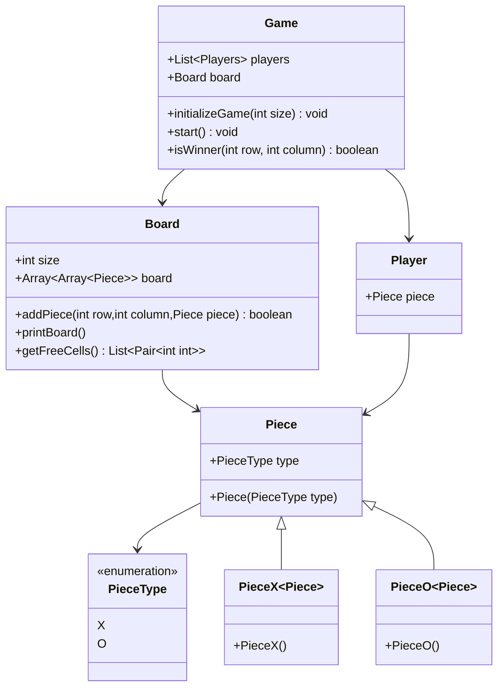

### WIP

# Tic-Tac-Toe

### Requirements

### Approach
From tic-tac-toe game we have objects like `Board`, `Players`, `Piece`. So lets say for each `Piece` we will have 
`PieceType` and 

```mermaid
classDiagram
    class PieceType {
        <<enumeration>>
        X
        O
    }
    class Piece {
        +PieceType type
        +Piece(PieceType type)
    }
    class PieceX~Piece~ {
        +PieceX()
    }
    class PieceO~Piece~ {
        +PieceO()
    }
    class Player {
        +Piece piece
    }
    class Board {
        +int size
        +Array~Array~Piece~~ board
        +addPiece(int row,int column,Piece piece) boolean
        +printBoard()
        +getFreeCells() List~Pair~int int~~
    }
    class Game {
        +List~Players~ players
        +Board board
        +initializeGame(int size) void
        +start() void
        +isWinner(int row, int column) boolean
    }
    Game --> Player
    Game --> Board
    Board --> Piece
    Player --> Piece
    Piece --> PieceType
    Piece <|-- PieceX
    Piece <|-- PieceO
    
```
